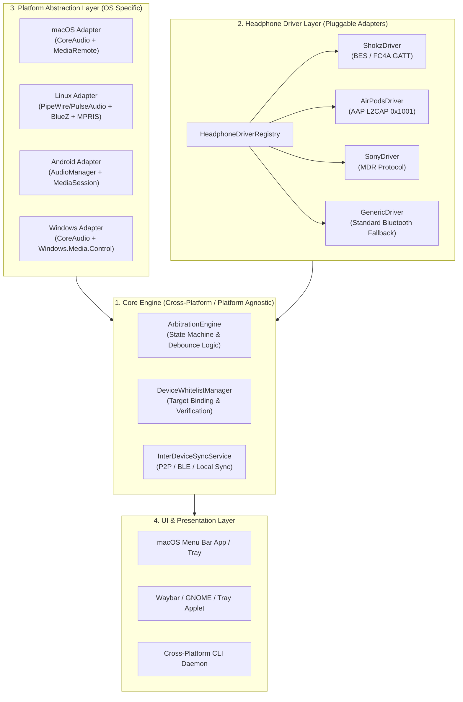
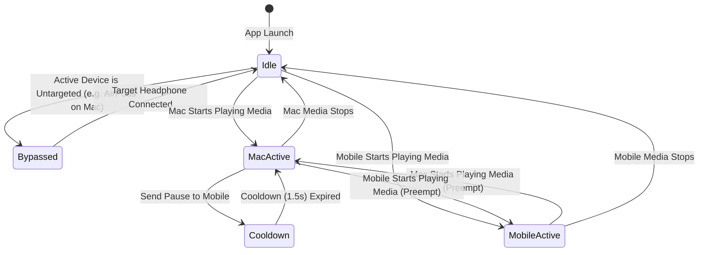

# AirFlow - Universal Headphone Handoff Manager Architecture & Specification

## 1. Executive Summary & Vision

### 1.1 Problem Statement
Modern wireless headphones face severe fragmentation in multi-device audio handoff:
1. **Proprietary Ecosystem Lock-in**: Apple AirPods offer seamless, dynamic audio handoff across Apple devices, but degrade to generic, static Bluetooth audio when used on Linux, Android, or Windows.
2. **Standard Bluetooth Multipoint Deficiencies**: Third-party multipoint headphones (e.g., Shokz OpenDots 2, Sony WH/WF series, Bose QC) employ a rigid **"First-Come, First-Served" (non-preemptive)** arbitration scheme. Playing media on Device B does not pause Device A; the headphone hardware simply discards Device B's A2DP packets silently.
3. **Single-Point Earbuds Isolation**: Millions of single-point earbuds cannot connect to two devices simultaneously, requiring tedious manual disconnect/reconnect workflows.

### 1.2 Vision & Objectives
The goal of this project is to build **`AirFlow`**: a **universal, cross-platform audio roaming and device manager** that:
- **Democratizes Seamless Handoff**: Gives non-Apple headphones (Shokz, Sony, Bose, etc.) an AirPods-like, preemptive audio handoff experience.
- **Bridges Cross-Ecosystem Gaps**: Enables Linux and Android systems to intelligently coordinate with macOS and iOS.
- **Provides First-Class Linux/Android AirPods Support**: Integrates reverse-engineered Apple Accessory Protocol (AAP) to unlock battery status, ANC mode toggling, and ear detection on Linux.
- **Zero-Intrusion on Mobile**: Requires no custom apps or jailbreaking on target iOS devices, relying on native Bluetooth pairing and OS-level primitives.

---

## 2. Research on Existing Open-Source Implementations & Prior Art

### 2.1 Linux AirPods Management & Apple Accessory Protocol (AAP)
Extensive research into the open-source Linux community reveals mature prior art reverse-engineering Apple's proprietary protocols:

* **Key Implementations**:
  - **[LibrePods](https://github.com/kavishdevar/librepods)**: Reverse-engineers AAP on Linux to provide a desktop GUI/daemon for ANC mode control, ear detection (auto play/pause), and granular battery levels for individual earbuds and the case.
  - **[airpods-helper](https://github.com/superninjv/airpods-helper)**: A lightweight Rust daemon communicating over L2CAP sockets with D-Bus integration, PipeWire parametric EQ, and connection management.
  - **[earport](https://github.com/Anoryth/earport)** & **[LinuxPods](https://github.com/Explor3Universe/LinuxPods)**: GNOME Shell extensions and KDE Plasma 6 plasmoids for real-time AirPods battery monitoring and noise cancellation switching.
  - **[AAP-Protocol-Definition](https://github.com/tyalie/AAP-Protocol-Defintion)**: Kaitai-based binary protocol specifications of the Apple Accessory Protocol.

* **Protocol Mechanics**:
  - **Transport**: Standard Bluetooth Classic / Dual Mode using **L2CAP channel (PSM `0x1001`)**, bypassing standard Bluetooth profiles (A2DP/AVRCP).
  - **Handshake**: Initiated by an Apple host (or emulator) over L2CAP. Upon successful key exchange, AirPods push asynchronous notifications for ear-in/ear-out, case lid status, and battery telemetry.
  - **Significance for AirFlow**: Allows our Linux/Android platform adapters to treat AirPods as first-class citizens, tracking their in-ear state and active audio routing without proprietary Apple hardware.

### 2.2 Shokz Proprietary GATT & Bestechnic (BES) Protocol
Live hardware probing on the Shokz OpenDots 2 revealed:
- **Chipset**: Bestechnic (BES) Bluetooth SoC (BES2600/2700 family).
- **Service Profiles**:
  - **Google Fast Pair Service (`0xFE2C`)**: Model ID `0x474E85`, exposes battery percentage for left ear, right ear, and case (`0xFE2C1239-8366...`).
  - **Shokz Vendor GATT (`0xFC4A`)**: Characteristic `0xFC4C` (Write) and `0xFC4B` (Notify).
  - **Bestechnic Core Vendor GATT (`0x01000100-0000-1000-8000-009078563412`)**: Characteristic `0x03000300...` (Write/Command) and `0x02000200...` (Notify/Telemetry).
- **Paired Devices Query**:
  The official Shokz mobile app uses this vendor GATT channel to query multipoint paired devices (Device 1 and Device 2 MACs & friendly names). This allows `AirFlow` to read connected devices directly from the headphone.

### 2.3 Sony & Bose Reverse-Engineered Drivers
- **Sony MDR Protocol** (e.g., `sony-headphones-client`): Transmitted over RFCOMM / SPP or BLE. Supports `GetPairedDevices` and `SwitchAudioConnection` commands.
- **Bose Headphone Protocol** (e.g., `Bose-QC35-Controller`): Supports multi-point link discovery and programmatic device swapping over vendor BLE UUIDs.

### 2.4 Windows Headphone Ecosystem & MagicPods Prior Art
On Windows 10 (1903+) and Windows 11, rich media and Bluetooth primitives exist to enable full parity:
- **[MagicPods](https://magicpods.app/)**: The de facto standard commercial application for AirPods on Windows. It uses Windows BLE APIs to sniff Apple proximity beacons, displays native popover animations, monitors individual earbud/case battery levels, and handles automatic audio routing when placing AirPods in the ear.
- **Global System Media Transport Controls (GSMTC / SMTC)**:
  - Accessible via the modern WinRT API `Windows.Media.Control.GlobalSystemMediaTransportControlsSessionManager`.
  - Enables listening to active playback state across Chrome, Edge, Spotify, VLC, and Windows Media Player, and invoking `TryPauseAsync()` / `TryPlayAsync()` globally.
- **Windows Core Audio (WASAPI)**:
  - `IMMDeviceEnumerator` and `IMMNotificationClient::OnDefaultDeviceChanged` allow real-time notifications of default audio endpoint changes.
- **WinRT Bluetooth GATT**:
  - `Windows.Devices.Bluetooth.GenericAttributeProfile` natively supports reading and subscribing to vendor GATT characteristics (e.g., Shokz Fast Pair `0xFE2C` and BES `0xFC4A`).

---

## 3. Core Problem & Mechanics

### 3.1 Multipoint Headphones: Preemptive Audio Arbitration
Standard multipoint headphones connect to Device A (Phone) and Device B (PC) simultaneously:
1. **The Issue**: When Device A is streaming audio, the headphone DSP locks its DAC pipeline to A2DP Stream 0. When Device B begins playing, its AVDTP packets are discarded.
2. **The Solution in AirFlow**:
   - Host B (e.g., Mac/Linux) detects active media output via system media APIs (`MediaRemote` / `MPRIS`).
   - Host B issues a coordinated pause to Device A (via BLE HID command or inter-device sync).
   - Device A suspends its A2DP stream (`AVDTP_SUSPEND`).
   - Headphone DSP detects Link A is idle and automatically grants DAC routing to Link B within 200–400ms.

### 3.2 Single-Point Headphones: Dynamic Connection Roaming
For headphones without multipoint hardware:
1. **The Issue**: They can only maintain one ACL link at a time.
2. **The Solution in AirFlow**:
   - When Host B wants to play, it commands Host A to drop its Bluetooth connection (or commands the headphone via vendor protocol to switch).
   - Host B immediately triggers an incoming ACL paging/reconnect.
   - Result: Emulates seamless multi-device roaming even on single-point hardware!

---

## 4. System Architecture

`AirFlow` employs a 4-tier decoupled modular architecture to ensure complete cross-platform portability:



---

## 5. Detailed Component Specifications

### 5.1 Platform Abstraction Layer
Each operating system implements two fundamental interfaces:
1. **`AudioDeviceMonitor`**:
   - Observes changes to the default audio output device.
   - Reports device name, transport type (Bluetooth Classic / LE / Builtin), and connection state.
   - **Gatekeeper Filter**: If the active output device is an untargeted headphone (e.g., native AirPods on macOS), the engine transitions into **Bypass Mode** to avoid conflicting with Apple's native handover.
2. **`MediaPlaybackObserver`**:
   - Monitors active NowPlaying media sessions (ignoring transient system notifications, typing chimes, or alerts).
   - Provides `pauseGlobalMedia()` and `resumeGlobalMedia()`.

| Operating System | Audio Device Monitor | Media Playback Observer | Bluetooth & GATT Stack | Native UI Shell |
| :--- | :--- | :--- | :--- | :--- |
| **macOS** | `CoreAudio` (`kAudioHardwarePropertyDefaultOutputDevice`) | Private `MediaRemote.framework` (`MRMediaRemoteSendCommand`) | `CoreBluetooth` / `IOBluetooth` | `NSStatusItem` + SwiftUI Popover |
| **Linux** | `PipeWire` / `PulseAudio` (`libpipewire` / `pactl`) | `MPRIS` D-Bus (`org.mpris.MediaPlayer2.Player`) | `BlueZ` D-Bus + L2CAP Sockets | Waybar JSON / AppIndicator / GNOME |
| **Windows** | `WASAPI` (`IMMNotificationClient::OnDefaultDeviceChanged`) | `GSMTC WinRT` (`GlobalSystemMediaTransportControlsSessionManager`) | `Windows.Devices.Bluetooth.GenericAttributeProfile` | Taskbar Tray + WinUI 3 / Modern Flyout |
| **Android** | `AudioManager` (`AudioDeviceCallback`) | `MediaSessionManager` (`getActiveSessions`) | Android BLE `BluetoothGatt` | Material 3 Notification Tile |

### 5.2 Headphone Driver Interface
Headphone drivers adhere to a common Swift/C/Rust protocol:

```swift
public protocol HeadphoneDriver: AnyObject {
    /// Unique identifier of the driver (e.g., "shokz.opendots", "apple.airpods")
    var driverId: String { get }
    
    /// Friendly brand name
    var brandName: String { get }
    
    /// Whether this driver can handle the given Bluetooth device
    func canHandle(device: BluetoothDeviceInfo) -> Bool
    
    /// Query paired/connected devices list from the headphone firmware
    func queryPairedDevices(peripheral: BluetoothPeripheral) async throws -> [PairedDeviceInfo]
    
    /// Request the headphone to switch audio routing or disconnect/reconnect a link
    func requestAudioHandoff(to targetDeviceId: String) async throws -> Bool
}
```

### 5.3 Device Whitelist & Pairing Flow
To prevent accidental interference with nearby devices in shared environments:
1. **Audio Device Auto-Discovery**:
   - The app reads connected Bluetooth audio sinks from the OS.
   - Automatically selects devices matching target driver signatures (e.g., "Shokz", "OpenDots", "WH-1000XM5").
2. **Paired Device Verification**:
   - When supported by the headphone driver (e.g. `ShokzDriver`), the app queries the headphone over BLE to retrieve the secondary device name (e.g. `Exobrain`).
   - The user confirms with a single click: *"Bind Exobrain as the mobile peer"*.
3. **Strict Whitelist Enforcement**:
   - Control commands are strictly addressed to the whitelisted device identifier. All other scanned peripherals are ignored.

### 5.4 Arbitration Engine & Anti-Ping-Pong State Machine
To avoid mutual pause deadlocks and ping-pong loops:



* **Cooldown Lock (1.5s)**: After sending a pause command to the peer, status updates from the peer are suppressed for 1.5 seconds to prevent recursive triggering.

---

## 6. Implementation Roadmap

### Phase 1: Reference Implementation (macOS + Shokz + iPhone)
- [x] Comprehensive requirements, research, and architecture specification in English.
- [x] Empirical validation of CoreAudio gatekeeper, MediaRemote global control, and Shokz BLE services.
- [x] Core macOS daemon implementation (`CoreAudioMonitor`, `MediaRemoteObserver`, `DeviceWhitelistManager`, `ArbitrationEngine`).
- [x] Implement `ShokzDriver` supporting battery telemetry and Fast Pair parsing.
- [x] Menubar UI with battery gauges, device switcher, status badges, and AirPods bypass.
- [x] Hardware-independent unit tests for Gatekeeper and Whitelist.

### Phase 2: Inter-Device Communication Hardening
- [ ] Refine mobile control channel (One-time BLE bonding & low-latency command dispatch).
- [ ] Integrate configurable Cooldown and Undo banner notification.

### Phase 3: Universal Driver Extensions
- [ ] Implement `AirPodsDriver` for Linux based on LibrePods / AAP L2CAP specification.
- [ ] Implement `SonyDriver` for Sony WH/WF series based on MDR protocol.
- [ ] Implement `GenericDriver` supporting automated disconnect/reconnect for single-point earbuds.

### Phase 4: Cross-Platform Expansion (Linux & Windows)
- [ ] Linux daemon implementation using BlueZ D-Bus, PipeWire, and MPRIS.
- [ ] Windows daemon implementation using WASAPI, GSMTC WinRT (`GlobalSystemMediaTransportControlsSessionManager`), and modern flyout tray UI.
- [ ] Android companion service.
