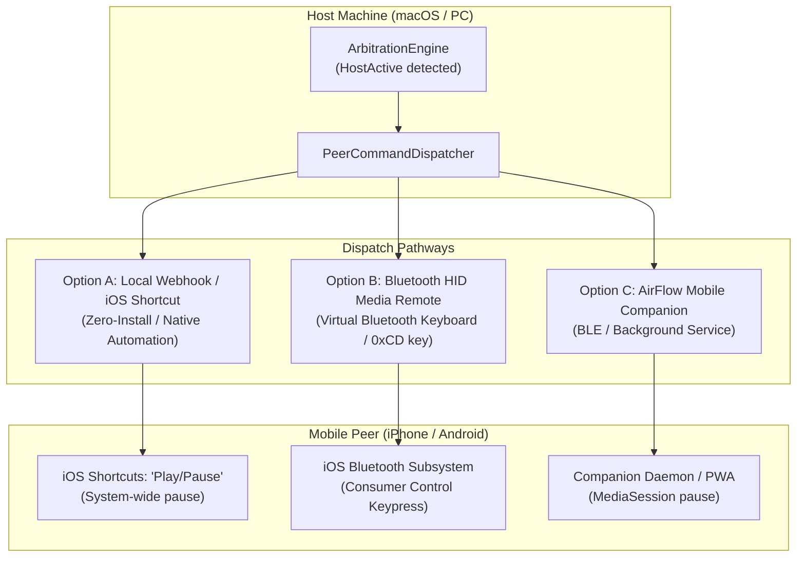

# Hardware Troubleshooting, Empirical Findings, and Recommendations

This document records the empirical findings, hardware diagnostic results, protocol analysis of Shokz / Bestechnic hardware, and architectural recommendations for cross-platform audio roaming in **AirFlow**.

---

## 1. Battery Telemetry Investigation

### 1.1 macOS `IOBluetoothDevice` Capabilities and Limitations
On macOS, battery information for connected Bluetooth audio devices is queried through the private `IOBluetoothDevice` framework APIs:

```swift
let single = dev.value(forKey: "batteryPercentSingle") as? Int  // Primary headset battery (HFP)
let left   = dev.value(forKey: "batteryPercentLeft") as? Int    // Apple proprietary (AirPods/Beats)
let right  = dev.value(forKey: "batteryPercentRight") as? Int   // Apple proprietary (AirPods/Beats)
let caseLvl = dev.value(forKey: "batteryPercentCase") as? Int   // Apple proprietary (AirPods/Beats)
```

#### Empirical Findings:
1. **Apple AirPods/Beats vs. Third-Party Headphones**:
   - For Apple devices with H1/H2/W1 chips, macOS native daemons (`bluetoothd`) decode proprietary Apple Accessory Protocol (AAP) beacons and populate `batteryPercentLeft`, `batteryPercentRight`, and `batteryPercentCase`.
   - For **all third-party Bluetooth headphones** (including Shokz OpenDots/OpenFit, Sony WH/WF series, Bose, Sennheiser), macOS **only populates `batteryPercentSingle`** via standard Hands-Free Profile (HFP) `AT+IPHONEACCEV` battery reports.
   - Consequently, `batteryPercentLeft`, `batteryPercentRight`, and `batteryPercentCase` return `0` / `nil`.
2. **Artificial Value Duplication Pitfall**:
   - In earlier versions of AirFlow, a fallback `finalLeft = left ?? single` and `finalRight = right ?? single` caused the unified single battery value (e.g. 100%) to be duplicated into identical Left and Right badges, while the Case displayed `--`.
   - **Resolution (PR #9)**: AirFlow now faithfully reflects hardware reporting: when only a single unified battery is exposed by the OS, it displays a clean **`Battery: XX%`** badge. Independent Left/Right badges are only rendered when distinct per-earbud telemetry is actively present.
3. **Charging Case Radio State**:
   - In True Wireless Stereo (TWS) designs, the charging case contains no independent Bluetooth transceiver connected to the host PC when closed.
   - When earbuds are removed and in use, the case enters low-power sleep mode and does not emit Bluetooth signals.
   - Battery level of the case is communicated to the earbuds exclusively through physical pogo pins when docked or upon lid opening.

---

### 1.2 Shokz Proprietary Battery Telemetry Channels
Empirical scanning of the Shokz OpenDots 2 hardware revealed two vendor-specific telemetry channels:

#### Channel A: Classic Bluetooth RFCOMM Channel 28 (GAIA / SPP)
- **Protocol**: Bestechnic / Qualcomm GAIA serial protocol over RFCOMM.
- **Payload**: The earbud periodically emits 44-byte frames starting with magic header `0xA5 0x5A`:
  ```
  Frame: [0xA5, 0x5A, 0x30, 0x00, 0x01, 0x01, 0x00, 0x00, len_lo, len_hi, ... payload ...]
  ```
  - `CMD 0x30`: Per-device battery telemetry.
  - `payload[0]`: Device hardware identifier.
  - `payload[1]`: Battery percentage (0–100%).
  - `payload[30]`: Component marker (`6` = direct Shokz earbud component).
  - `payload[42]`: Role flag (`0x00` = Left earbud / Primary ACL link, `0xFF` = Right earbud / Secondary TWS mesh).
  - `payload[43]`: Charging status (`0x01` = docked in charger).
- **Exclusivity Constraint**: RFCOMM Channel 28 is an exclusive point-to-point connection. When the Shokz mobile app is active on the user's phone, the phone holds an exclusive lock on Channel 28, causing connection attempts from macOS to return `kIOReturnExclusiveAccess` (`-536870212`).

#### Channel B: BLE GATT Service `66666666-6666-6666-6666-666666666666`
- **Characteristic `77777777-7777-7777-7777-777777777777`**: Supports `WriteWithoutResponse` and `Notify`.
- Used by iOS applications where classic Bluetooth RFCOMM is restricted by Apple MFi policies.
- Encapsulates `A5 5A` command packets for firmware configuration and EQ presets.

---

## 2. Remote Pause & Handoff Investigation

### 2.1 Why "Test Pause" Failed Across Existing Modes

| Strategy | Intended Mechanism | Empirical Reality & Failure Cause |
| :--- | :--- | :--- |
| **Headphone GATT** | Send vendor BLE packet to headphone to proxy pause to the phone. | **Hardware Limitation**: Headphone firmware acts as an AVRCP Controller (CT) exclusively in response to physical capacitive touch gestures. The vendor BLE GATT service (`0xFC4A`, `0x6666`) is strictly for local DSP configuration (EQ, firmware updates) and **does not expose any API to inject remote AVRCP commands into secondary ACL connections**. Packets sent to this service receive NACK (`84 02`) or are discarded. |
| **BLE Companion Remote** | Broadcast `AirFlow Remote` GATT service (`0xA1BF0001-...`). | **Missing Receiver**: The service was actively advertised by macOS, but no companion software or client was installed or subscribed on the mobile peer (`subscribedCentrals = 0`). |
| **BLE HID Media Key** | Send simulated Bluetooth HID Media Key (Play/Pause `0xCD`). | **Stub Implementation**: The initial codebase only logged an emulation message without establishing a physical or virtual Bluetooth HID profile. |
| **Local Network** | Send local network webhook to the mobile peer. | **Stub Implementation**: The initial codebase only logged a dispatch message without opening an HTTP socket or calling an automation endpoint. |

---

### 2.2 Why iPhone Shows Mac as "Not Connected" in Bluetooth Settings
When a user pairs an iPhone and a Mac via macOS System Settings -> Bluetooth:
1. **No Persistent Classic Bluetooth ACL Link**:
   - Neither the Mac nor the iPhone acts as an audio sink (A2DP) or hands-free headset for the other.
   - Apple's Bluetooth daemon deliberately tears down the classic Bluetooth connection immediately after pairing to conserve battery.
   - Native Apple ecosystem features (AirDrop, Continuity, Universal Clipboard, Handoff) communicate via **background BLE proximity advertisements + Apple Wireless Direct Link (AWDL) / Wi-Fi**, entirely bypassing classic Bluetooth connections.
2. **Behavior in iOS Settings**:
   - In iOS **Settings -> Bluetooth**, the Mac will always show as **"Not Connected" (未连接)** unless Personal Hotspot (Bluetooth PAN tethering) is actively streaming data.
   - Manually tapping the Mac entry in iOS will produce a "Connection Unsuccessful" alert because macOS does not advertise incoming Bluetooth audio or serial profiles to mobile devices.

---

## 3. Reverse Engineering of the Shokz Mobile App

To understand how the official Shokz application operates:
1. **Communication Channels**:
   - On Android: Establishes a background RFCOMM Channel 28 connection to stream live battery data (`A5 5A CMD 0x30`) and configure DSP parameters.
   - On iOS: Uses CoreBluetooth to connect to GATT service `66666666-6666-6666-6666-666666666666` (characteristic `77777777-7777-7777-7777-777777777777`).
2. **Dual-Device Connection Management**:
   - In the "Dual Pairing" (双设备连接) screen of the Shokz app, the app can:
     - Query the headphone's internal paired device table (`AA 55 05 01...`).
     - Instruct the headphone to disconnect or connect an ACL link to a specified Bluetooth MAC address.
   - **Crucial Finding**: The Shokz app **cannot and does not remotely pause playback on other devices**. Switching audio in standard multipoint headphones is entirely driven by stream activity: the DSP locks to whichever source is active. If Device A is playing, Device B cannot preempt it unless Device A pauses its own stream or Device A's connection is forcefully terminated.

---

## 4. Architectural Recommendations for AirFlow

Because headphones do not provide a mechanism to remotely pause secondary devices over BLE, **AirFlow must coordinate pause signals directly between the host (Mac/PC) and the mobile device**.



### Recommendation 1: iOS Shortcuts Automation via Local Webhook (Immediate & Recommended)
- **Mechanism**:
  - AirFlow runs a lightweight HTTP webhook listener on macOS (e.g., `http://0.0.0.0:8388/pause`).
  - On the iPhone, a simple 1-step iOS Shortcut named `AirFlow Pause` executes the native action: **"Play/Pause on iPhone"**.
  - The Shortcut can be triggered via local network HTTP, SSH, or push services (e.g. Bark, ntfy.sh).
- **Advantages**:
  - **Zero App Store dependency**: Uses Apple's built-in iOS Shortcuts engine.
  - **Universal media pause**: Pauses any playing application system-wide (Apple Music, NetEase Cloud Music, Spotify, Podcasts, Bilibili, YouTube).
  - **High reliability**: Operates seamlessly whenever Mac and iPhone share a local Wi-Fi network.

### Recommendation 2: Bluetooth HID Media Remote Emulation
- **Mechanism**:
  - The host advertises a standard Bluetooth Human Interface Device (HID) profile with Consumer Control Usage Page (`0x0C`) and Usage `Play/Pause` (`0xCD`).
  - The user pairs their phone with this virtual remote in iOS **Settings -> Bluetooth**.
  - Once paired as an HID keyboard/remote, iOS maintains an active connection and displays **"Connected"**.
  - When Mac playback begins, AirFlow emits a keypress report for `0xCD`, pausing the phone at the operating system hardware layer.
- **Implementation Note**:
  - On macOS, user-space apps cannot advertise the standard BLE HID Service (`0x1812`) without the private Apple entitlement `com.apple.developer.corebluetooth.hid`.
  - Classic Bluetooth HID emulation requires registered SDP service records (`IOBluetoothSDPServiceRecord`) and L2CAP channels (`kBluetoothL2CAPPSMHIDControl` / `kBluetoothL2CAPPSMHIDInterrupt`).

### Recommendation 3: BLE Companion / Web BLE PWA
- **Mechanism**:
  - A lightweight Progressive Web App (PWA) using Web Bluetooth API or a native iOS/Android companion app connects to `AirFlow Remote` (`0xA1BF0001-...`).
  - Subscribes to command notifications and calls the system `MediaSession` API to pause audio.
- **Applicability**: Best suited for mobile platforms (such as Android) where background BLE services operate with minimal restrictions.
